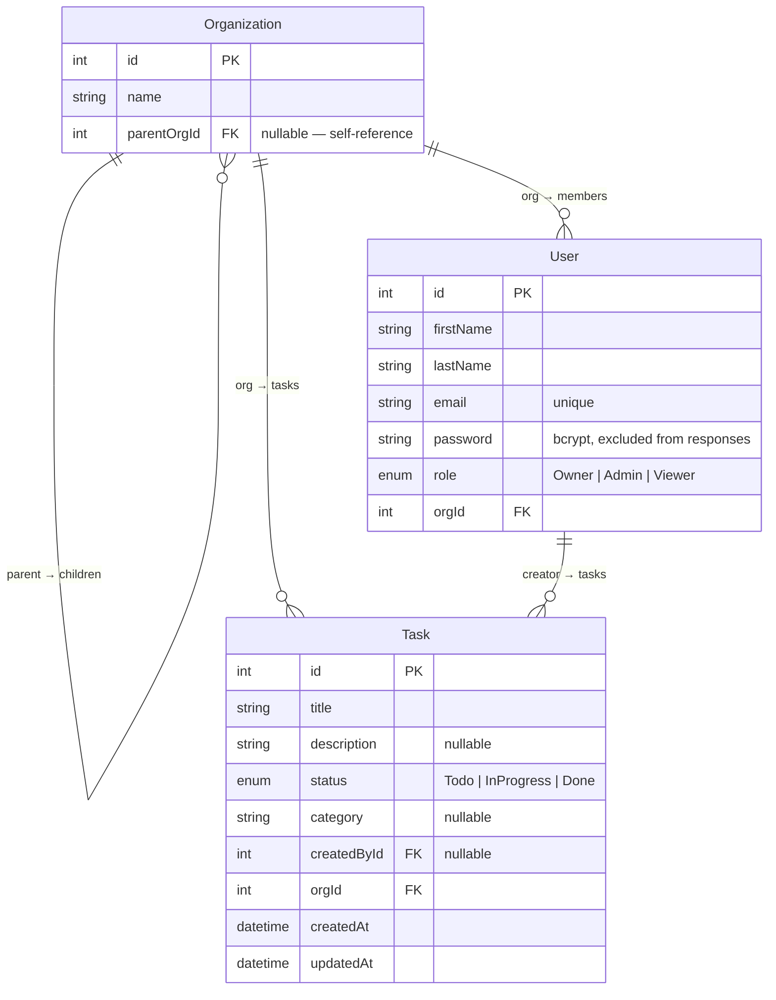

# TaskFlow

A full-stack task management application built with NestJS, Angular 21, and PostgreSQL in an NX monorepo.

---

## Table of Contents

1. [Setup Instructions](#setup-instructions)
2. [Architecture Overview](#architecture-overview)
3. [Data Model](#data-model)
4. [Access Control Implementation](#access-control-implementation)
5. [API Documentation](#api-documentation)

---

## Setup Instructions

### Prerequisites

| Tool | Version |
|------|---------|
| Node.js | 20+ |
| pnpm | 9+ |
| PostgreSQL | 14+ |

### Install Dependencies

```bash
pnpm install
```

### Environment Configuration

Create a `.env` file at the **repository root** (next to `nx.json`). The API loads it automatically via `@nestjs/config`.

```bash
cp apps/api/.env.example .env
```

| Variable | Description | Example |
|----------|-------------|---------|
| `JWT_SECRET` | Secret used to sign JWTs — change in production | `change-me-in-production` |
| `JWT_EXPIRES_IN` | Token expiry (ms/zeit format) | `3600s` |
| `DB_HOST` | PostgreSQL host | `localhost` |
| `DB_PORT` | PostgreSQL port | `5432` |
| `DB_USERNAME` | PostgreSQL user | `postgres` |
| `DB_PASSWORD` | PostgreSQL password | `password` |
| `DB_NAME` | Database name | `taskflow` |
| `DB_SSL` | Enable SSL for the DB connection (`true`/`false`) | `false` |

> **Note:** `DB_SSL=true` configures the connection with `rejectUnauthorized: false` (suitable for managed cloud databases). Set to `false` for local development.

### Running the Applications

Open two terminal windows:

```bash
# Terminal 1 — NestJS API (http://localhost:3000)
nx serve api

# Terminal 2 — Angular frontend (http://localhost:4200)
nx serve frontend
```

The Angular dev server automatically proxies all `/api/*` requests to `http://localhost:3000` via `apps/frontend/proxy.conf.json`.

### Seeding the Database

```bash
nx run api:seed
```

This creates three demo users across a sample organization:

| Email | Password | Role |
|-------|----------|------|
| `owner@example.com` | `password123` | Owner |
| `admin@example.com` | `password123` | Admin |
| `viewer@example.com` | `password123` | Viewer |

### Running Tests

```bash
nx test api          # NestJS unit tests (Jest)
nx test frontend     # Angular unit tests (Vitest)
nx e2e api-e2e       # End-to-end tests (Playwright)
```

---

## Architecture Overview

### Why an NX Monorepo?

The codebase uses [NX](https://nx.dev) to manage both applications and their shared code in a single repository. Key benefits:

- **Shared libraries** — code shared between backend and frontend is in `libs/` and imported by both without publishing to a registry.
- **Unified toolchain** — a single `pnpm install`, consistent lint/test/build configuration, and NX's computation cache for fast rebuilds.
- **Dependency graph** — `nx graph` visualises the project dependency tree and enforces boundary rules.

### Project Layout

```
.
├── apps/
│   ├── api/                  # NestJS 11 backend
│   │   └── src/
│   │       ├── app/          # Root module, TypeORM config
│   │       ├── auth/         # JWT strategy, guards, login/sign-up
│   │       ├── users/        # Users CRUD
│   │       ├── tasks/        # Tasks CRUD
│   │       ├── organizations/# Organizations CRUD
│   │       └── seed.ts       # Database seeding script
│   │
│   ├── frontend/             # Angular 21 SPA
│   │   └── src/app/
│   │       ├── auth/         # Login component, auth service, interceptor, guards
│   │       ├── shell/        # Layout wrapper component
│   │       └── tasks/        # Task list, task form dialog
│   │
│   └── api-e2e/              # end-to-end tests
│
├── libs/
│   └── auth/                 # Shared auth library (@taskMgr/auth)
│       └── src/lib/
│           ├── user-role.enum.ts
│           ├── jwt-payload.interface.ts
│           ├── permissions.config.ts
│           ├── roles.decorator.ts
│           └── roles.guard.ts
│
├── nx.json                   # NX workspace config
├── pnpm-workspace.yaml
└── tsconfig.base.json        # Path alias: @taskMgr/auth → libs/auth/src/index.ts
```

### Projects at a Glance

| Project | Type | Stack | Port |
|---------|------|-------|------|
| `api` | Application | NestJS 11, TypeORM, PostgreSQL, Passport JWT | 3000 |
| `frontend` | Application | Angular 21, Angular Material, Tailwind CSS 4 | 4200 |
| `api-e2e` | E2E tests | — |
| `auth` | Library | TypeScript | — |

### Shared Auth Library (`@taskMgr/auth`)

`libs/auth` is consumed by both the API and the frontend. It exports:

- `UserRole` enum — the single source of truth for role values (`Owner`, `Admin`, `Viewer`)
- `JwtPayload` interface — the shape of the decoded JWT, used by the API strategy and the Angular auth service
- `RolesGuard` — NestJS guard that reads `@Roles()` metadata and enforces permissions
- `Roles` decorator — attaches required permission actions to controller methods
- `ROLE_PERMISSIONS` — the role → permission mapping matrix

Sharing this library eliminates drift between frontend and backend type definitions and ensures the permission matrix has one canonical location.

---

## Data Model

### Entities

**Organization** — represents a company or team. Supports self-referencing parent/child relationships to model org hierarchies of arbitrary depth.

**User** — a system user belonging to exactly one organization with one of three roles (Owner, Admin, Viewer).

**Task** — a work item scoped to an organization, optionally assigned a creator.

### Entity Relationship Diagram



### Enum Values

**UserRole** (`libs/auth/src/lib/user-role.enum.ts`)

| Value | Description |
|-------|-------------|
| `Owner` | Full access including org and user management |
| `Admin` | Full task access; no org/user management |
| `Viewer` | Full task access; no org/user management |

**TaskStatus** (`apps/api/src/tasks/entities/task-status.enum.ts`)

| Value | Description |
|-------|-------------|
| `Todo` | Not started (default) |
| `InProgress` | In progress |
| `Done` | Completed |

> **Schema sync:** TypeORM runs with `synchronize: true` in development (auto-creates and alters tables). In production (`NODE_ENV=production`) synchronization is disabled and migrations should be used.

---

## Access Control Implementation

### Three-Layer Security Model

Every API request passes through three layers in order:

```
Request
  │
  ▼
JwtAuthGuard (global APP_GUARD)
  │  Checks for @Public() → bypass if present
  │  Otherwise validates Bearer token, throws 401 if invalid/missing
  │  Populates req.user with JwtPayload
  ▼
RolesGuard (global APP_GUARD)
  │  Reads @Roles(...actions) metadata from the handler
  │  If no @Roles() → allow all authenticated users
  │  Maps req.user.role to permission set via ROLE_PERMISSIONS
  │  Throws 403 if required action is not in the user's permission set
  ▼
Controller method
```

### JWT Payload

```typescript
interface JwtPayload {
  sub: number;          // User ID
  email: string;
  role: UserRole | null;
  orgId: number | null; // Organization ID
  orgName: string | null;
}
```

The strategy (`jwt.strategy.ts`) throws `UnauthorizedException` if `role` or `orgId` is missing from the payload, ensuring tokens issued before a user is fully provisioned are rejected.

### Sign-Up Flow

`POST /api/auth/sign-up` runs inside a database transaction:
1. Creates a new `Organization` with `parentOrgId = null`.
2. Creates the `User` with role `Owner`, linked to the new org.
3. Signs and returns a JWT containing the user's id, email, role, orgId, and orgName.

This guarantees every Owner always has an organization; a partial failure rolls back both inserts.

### Login Flow

`POST /api/auth/login`:
1. Looks up the user by email.
2. Verifies the plaintext password against the stored bcrypt hash (10 rounds).
3. Signs and returns a JWT with the user's current role and org data.

### Role → Permission Matrix

Defined in `libs/auth/src/lib/permissions.config.ts` and shared across the monorepo.

| Permission | Owner | Admin | Viewer |
|------------|:-----:|:-----:|:------:|
| `createTask` | ✓ | ✓ | Own |
| `readTask` | ✓ | ✓ | ✓ |
| `updateTask` | ✓ | ✓ | Own |
| `deleteTask` | ✓ | ✓ | Own |
| `manageOrg` | ✓ | — | — |
| `manageUsers` | ✓ | — | — |

### Organization Hierarchy

Organizations form a tree via the `parentOrgId` self-reference. An Owner can create child organizations by supplying `parentOrgId` in `POST /api/organizations`. There is no enforced depth limit — the hierarchy can be arbitrarily deep.

### Frontend Auth

- JWT is stored in `localStorage` under the key `auth_token`.
- `authInterceptor` attaches `Authorization: Bearer <token>` to every outgoing request except `/auth/login`.
- Any `401` response triggers an automatic logout and redirect to `/login`.
- `canModify(task)` helper returns `true` if the user is Owner/Admin **or** is the task creator — used to show/hide edit and delete buttons.

---

## API Documentation

**Base URL:** `http://localhost:3000/api`

**Authentication:** All endpoints require `Authorization: Bearer <token>` unless marked **Public**.

### Endpoint Reference

| Method | Path | Auth | Required Permission | Description |
|--------|------|------|-------------------|-------------|
| `POST` | `/auth/sign-up` | Public | — | Register; creates org + Owner user |
| `POST` | `/auth/login` | Public | — | Login; returns JWT |
| `GET` | `/organizations` | Public | — | List all organizations |
| `GET` | `/organizations/:id` | Public | — | Get organization by ID |
| `POST` | `/organizations` | JWT | `manageOrg` | Create organization (supports hierarchy) |
| `PATCH` | `/organizations/:id` | JWT | — | Update organization |
| `DELETE` | `/organizations/:id` | JWT | `manageOrg` | Delete organization |
| `GET` | `/tasks` | JWT | `readTask` | List tasks (scoped to caller's org) |
| `GET` | `/tasks/:id` | JWT | `readTask` | Get task by ID |
| `POST` | `/tasks` | JWT | `createTask` | Create task |
| `PATCH` | `/tasks/:id` | JWT | `updateTask` | Update task |
| `DELETE` | `/tasks/:id` | JWT | `deleteTask` | Delete task |
| `GET` | `/users` | JWT | `manageUsers` | List all users |
| `GET` | `/users/:id` | JWT | `manageUsers` | Get user by ID |
| `POST` | `/users` | JWT | `manageUsers` | Create user in org |
| `PATCH` | `/users/:id` | JWT | `manageUsers` | Update user |
| `DELETE` | `/users/:id` | JWT | `manageUsers` | Delete user |

---

### Sample Requests & Responses

#### Register a new account

```http
POST /api/auth/sign-up
Content-Type: application/json

{
  "firstName": "Jane",
  "lastName": "Doe",
  "email": "jane@acme.com",
  "password": "secret123",
  "orgName": "Acme Corp"
}
```

```json
HTTP/1.1 201 Created

{
  "access_token": "eyJhbGciOiJIUzI1NiIsInR5cCI6IkpXVCJ9..."
}
```

---

#### Login

```http
POST /api/auth/login
Content-Type: application/json

{
  "email": "jane@acme.com",
  "password": "secret123"
}
```

```json
HTTP/1.1 200 OK

{
  "access_token": "eyJhbGciOiJIUzI1NiIsInR5cCI6IkpXVCJ9..."
}
```

```json
HTTP/1.1 401 Unauthorized

{
  "statusCode": 401,
  "message": "Unauthorized"
}
```

---

#### Create a task

```http
POST /api/tasks
Authorization: Bearer <token>
Content-Type: application/json

{
  "title": "Write unit tests",
  "description": "Cover auth service and tasks controller",
  "status": "Todo",
  "category": "Engineering"
}
```

```json
HTTP/1.1 201 Created

{
  "id": 42,
  "title": "Write unit tests",
  "description": "Cover auth service and tasks controller",
  "status": "Todo",
  "category": "Engineering",
  "createdById": 7,
  "orgId": 3,
  "createdAt": "2026-05-14T18:00:00.000Z",
  "updatedAt": "2026-05-14T18:00:00.000Z"
}
```

---

#### List tasks

```http
GET /api/tasks
Authorization: Bearer <token>
```

```json
HTTP/1.1 200 OK

[
  {
    "id": 42,
    "title": "Write unit tests",
    "description": "Cover auth service and tasks controller",
    "status": "Todo",
    "category": "Engineering",
    "createdById": 7,
    "orgId": 3,
    "createdAt": "2026-05-14T18:00:00.000Z",
    "updatedAt": "2026-05-14T18:00:00.000Z"
  }
]
```

---

#### Update a task

```http
PATCH /api/tasks/42
Authorization: Bearer <token>
Content-Type: application/json

{
  "status": "InProgress"
}
```

```json
HTTP/1.1 200 OK

{
  "id": 42,
  "title": "Write unit tests",
  "status": "InProgress",
  "updatedAt": "2026-05-14T19:30:00.000Z"
}
```

---

#### Delete a task

```http
DELETE /api/tasks/42
Authorization: Bearer <token>
```

```
HTTP/1.1 204 No Content
```

---

#### Create a child organization (Owner only)

```http
POST /api/organizations
Authorization: Bearer <token>
Content-Type: application/json

{
  "name": "Acme Engineering",
  "parentOrgId": 3
}
```

```json
HTTP/1.1 201 Created

{
  "id": 8,
  "name": "Acme Engineering",
  "parentOrgId": 3
}
```

---

#### Create a user in the organization (Owner only)

```http
POST /api/users
Authorization: Bearer <token>
Content-Type: application/json

{
  "firstName": "Bob",
  "lastName": "Smith",
  "email": "bob@acme.com",
  "password": "secret456",
  "role": "Admin"
}
```

```json
HTTP/1.1 201 Created

{
  "id": 12,
  "firstName": "Bob",
  "lastName": "Smith",
  "email": "bob@acme.com",
  "role": "Admin",
  "orgId": 3
}
```

---

#### 403 Forbidden (insufficient role)

Returned when a Viewer or Admin attempts an action requiring `manageOrg` or `manageUsers`:

```json
HTTP/1.1 403 Forbidden

{
  "statusCode": 403,
  "message": "Forbidden resource",
  "error": "Forbidden"
}
```
